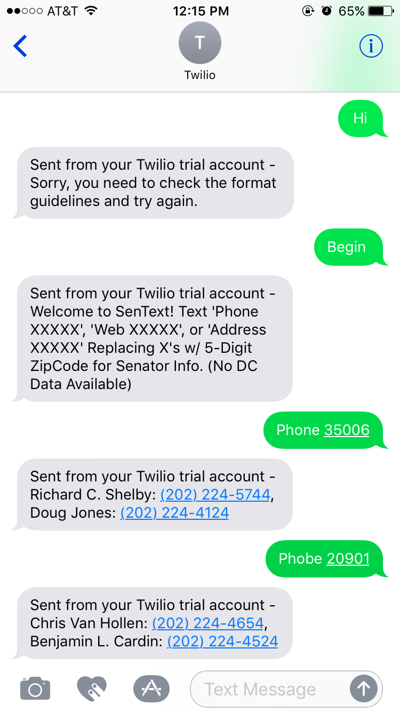
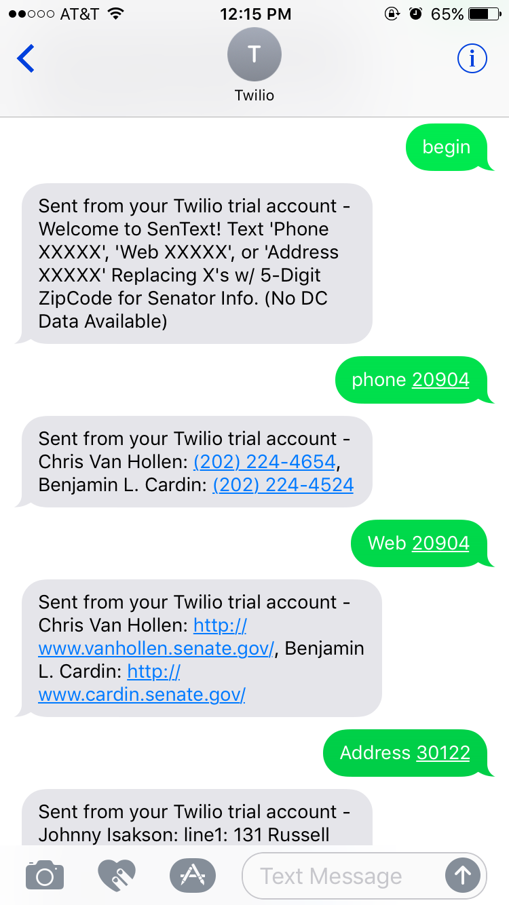

# Senator-Info Text
### Twilio + Google Civic API Texting Service Written in Python using Flask

For this Project, me and my partner decided to build something practical that could be used to help further the knowledge of those around us. We created a texting service that allows you to retrieve information about how to contact your Senator.

We wanted the project to be relatively user friendly, so we implemented an error checking procedures so that that typo's/spelling would not hinder the overall results of the program. 
We would have liked to declare all the API calls into one function or class, however, the twilio API is finicky, and we could not save the text responses, so the last response had to contain all the information. We used Regrex to extract the numbers from to add those to the API call to retrieve the information.

### Screenshots

